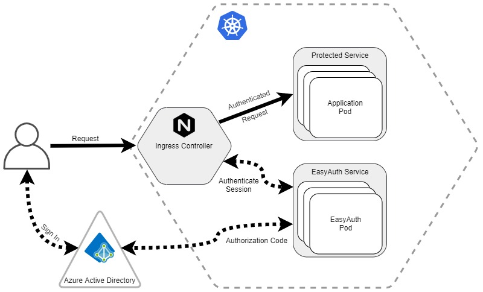

[](https://github.com/Azure/EasyAuthForK8s/actions/workflows/E2E.yml)

# EasyAuth for Kubernetes

EasyAuth for Kubernetes is a simple Identity and Access Management module that allows you to protect applications in a kubernetes cluster without having to modify application source code.

Similar to the [security features](https://docs.microsoft.com/en-us/azure/app-service/overview-authentication-authorization) of Azure App Service, EasyAuth for Kubernetes is designed to do four basic functions:
* Authenticate callers via Azure Active Directory
* Authorize callers based on required roles or scopes
* Manage authenticated sessions
* Inject basic information about the user into the request received by your application

EasyAuth uses Azure AD v2 endpoints, which allows you leverage all features of the [Microsoft Identity Platform](https://docs.microsoft.com/en-us/azure/active-directory/develop/v2-overview).

A few of these features include:
* Authenticating employees or business partners
* Azure AD B2C custom policies for complex identity flows
* MFA and conditional access
* Role-based access control
* Multitenant applications

## Concepts
EasyAuth for Kubernetes integrates with your cluster's [ingress controller](https://kubernetes.io/docs/concepts/services-networking/ingress-controllers/).  When a request is received, the EasyAuth service validates the user's session.  If the caller isn't authenticated yet, the service will route the caller to the appropriate Azure AD tenant to sign in.  The service then starts a managed session for the user and adds a cookie to the response that will be used to authenticate the caller on future requests.

> Note: The authentication flow supports single sign on, so the user will not be prompted for credentials if they are already signed via the Azure AD tenant.  



The diagram above conveys the basic interaction between the components for a user accessing a web application. For simplicity, this shows a single protected application and a single EasyAuth service.  You can, however, configure as many EasyAuth services as you would like within your cluster.  Each service can protect one or more applications, and have different Azure AD tenant configurations.   

> For example, you could have one set of applications accessible only by internal employees and another set of applications for customers or external users all running in the same cluster and using the same ingress controller.

## Quickstart using Azure Cloud Shell
Try it out by setting up a new AKS cluster with a sample application that uses EasyAuth.  Launch [Cloud Shell](https://shell.azure.com/bash), then run the following bash commands:
```
git clone https://github.com/Azure/EasyAuthForK8s.git
cd EasyAuthForK8s

# Hint - run bash main.sh -h for parameter help
# Note: AAD app name (-a) must be *globally* unique
# Note: Cluster name (-c) must be unique
# Estimated Runtime: 15 minutes
bash main.sh -a {insert-unique-app-name} -c {insert-unique-cluster-name} -r easy-auth -e email@contoso.com -l eastus
```
What the quickstart script does:
1) Deploy an AKS cluster
2) Install an Nginx Ingress controller
3) Configure DNS for the cluster public IP
4) Register an AAD Application
5) Install Cert Manager
6) Deploy the Easy Auth Proxy
7) Deploy the Application

## Documentation
* [Setup Instructions](docs/setup-instructions.md) - step-by-step guide to building a cluster, configuring the ingress controller, and deploying an application protected by EasyAuth
* [Deploy to an Existing Cluster](docs/deploy-to-existing-cluster.md) - an in-depth guide to deploying EasyAuth to an existing cluster and application
* [Detailed Architecture](docs/detailed-architecture.md) - an in-depth guide to how EasyAuth works
* [Calling a Protected API](docs/protecting-an-api.md) - how to authenticate a client application and call an API protected by EasyAuth
* [Http Headers](docs/headers.md) - Get information about the user that is accessing your application
* [Proxy Configuration](docs/configuration.md) - an in-depth guide to configure the proxy

# Contributing

This project welcomes contributions and suggestions.  Most contributions require you to agree to a
Contributor License Agreement (CLA) declaring that you have the right to, and actually do, grant us
the rights to use your contribution. For details, visit https://cla.opensource.microsoft.com.

When you submit a pull request, a CLA bot will automatically determine whether you need to provide
a CLA and decorate the PR appropriately (e.g., status check, comment). Simply follow the instructions
provided by the bot. You will only need to do this once across all repos using our CLA.

This project has adopted the [Microsoft Open Source Code of Conduct](https://opensource.microsoft.com/codeofconduct/).
For more information see the [Code of Conduct FAQ](https://opensource.microsoft.com/codeofconduct/faq/) or
contact [opencode@microsoft.com](mailto:opencode@microsoft.com) with any additional questions or comments.
