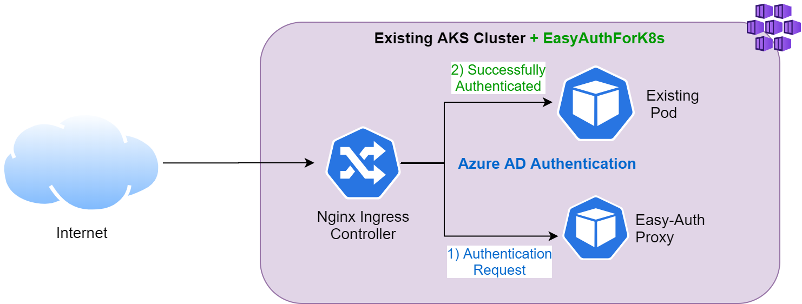

# Example AKS cluster


# Example AKS cluster after deploying EasyAuthForK8s


## Set Variables

Review these very carefully and modify.

    # Set your backend service variables
    SERVICE=<insert name of K8s service you want to redirect to after login>
    SERVICE_PORT=<insert service port of the K8s service you want to redirect to after login> 

    # Important! Set the name for your Azure AD App Registration
    AD_APP_NAME="$USER-easy-auth-proxy"
    
    # Set the email address for the cluster certificate issuer (**SKIP** this step if you've already deployed a cert-manager)
    EMAIL=example@microsoft.com
    
    # Region your resources are located in
    LOCATION=<insert existing cluster location>
    
    # Set APP_HOSTNAME to your existing cluster's hostname
    APP_HOSTNAME="<insert existing hostname>" # Note: Keep the quotation marks "" 

    # Note: If you don't have an existing hostname, use the one below
    APP_HOSTNAME="$AD_APP_NAME.$LOCATION.cloudapp.azure.com"

    # Set these variables
    HOMEPAGE=https://$APP_HOSTNAME
    REPLY_URLS=https://$APP_HOSTNAME/easyauth/signin-oidc

    # Set the secret name
    TLS_SECRET_NAME=<insert your existing secret-tls name>

    # To get the secret name of an existing cert, run the following command
    kubectl get certificates 

    # If you do not have a secret, set it below
    TLS_SECRET_NAME=$APP_HOSTNAME-tls

## Configure DNS for the cluster public IP (**SKIP** this step if you've already use a FQDN with HTTPS in your cluster)
To use AAD authentication for your application, you must use a FQDN with HTTPS.  For this tutorial, we will add a DNS record to the Ingress Public IP address.

```
# Get the AKS MC_ resource group name
NODE_RG=$(az aks show -n $CLUSTER_NAME -g $CLUSTER_RG -o json | jq -r '.nodeResourceGroup')
echo $NODE_RG

INGRESS_IP=$(kubectl get services/nginx-ingress-ingress-nginx-controller -n ingress-controllers -o jsonpath="{.status.loadBalancer.ingress[0].ip}")
echo $INGRESS_IP

IP_NAME=$(az network public-ip list -g $NODE_RG -o json | jq -c ".[] | select(.ipAddress | contains(\"$INGRESS_IP\"))" | jq '.name' -r)
echo $IP_NAME

# Add a DNS name ($AD_APP_NAME) to the public IP address
az network public-ip update -g $NODE_RG -n $IP_NAME --dns-name $AD_APP_NAME

# Get the FQDN assigned to the public IP address
INGRESS_HOST=$(az network public-ip show -g $NODE_RG -n $IP_NAME -o json | jq -r '.dnsSettings.fqdn')
echo $INGRESS_HOST
# This should be the same as the $APP_HOSTNAME
```

## Register AAD Application

```
# The default app created has permissions we don't need and can cause problem if you are in a more restricted tenant environment
# Copy/paste the entire snippet BELOW (and then press ENTER) to create the manifest.json file
cat << EOF > manifest.json
[
    {
      "resourceAccess" : [
          {
            "id" : "e1fe6dd8-ba31-4d61-89e7-88639da4683d",
            "type" : "Scope"
          }
      ],
      "resourceAppId" : "00000003-0000-0000-c000-000000000000"
    }
]
EOF
# End of snippet to copy/paste

# Important! Review the file and check the values.
cat manifest.json

# Create the Azure AD SP for our application and save the Client ID to a variable
CLIENT_ID=$(az ad app create --display-name $AD_APP_NAME --homepage $HOMEPAGE --reply-urls $REPLY_URLS --required-resource-accesses @manifest.json -o json | jq -r '.appId')
echo $CLIENT_ID

OBJECT_ID=$(az ad app show --id $CLIENT_ID -o json | jq '.objectId' -r)
echo $OBJECT_ID

az ad app update --id $OBJECT_ID --set oauth2Permissions[0].isEnabled=false
az ad app update --id $OBJECT_ID --set oauth2Permissions=[]

# The newly registered app does not have a password.  Use "az ad app credential reset" to add password and save to a variable.
CLIENT_SECRET=$(az ad app credential reset --id $CLIENT_ID -o json | jq '.password' -r)
echo $CLIENT_SECRET

# Get your Azure AD tenant ID and save to variable
AZURE_TENANT_ID=$(az account show -o json | jq '.tenantId' -r)
echo $AZURE_TENANT_ID
```

## Install Cert Manager (**SKIP** this step if you've already deployed a cert-manager)

We will use Cert-Manager to create and install SSL Certs from Let'sEncrypt onto our K8S Cluster.  This is because AAD requires all endpoints be either [localhost](http://localhost) or HTTPS. 

Inspired by [https://docs.microsoft.com/en-us/azure/aks/ingress-tls](https://docs.microsoft.com/en-us/azure/aks/ingress-tls).

### Deploy Production Cert Manager

```
# Create the namespace 
kubectl create namespace cert-manager

# Add the Jetstack Helm repository
helm repo add jetstack https://charts.jetstack.io

# Update your local Helm chart repository cache
helm repo update

# Install the cert manager
helm install \
  cert-manager jetstack/cert-manager \
  --namespace cert-manager \
  --version v1.3.1 \
  --set installCRDs=true \
  --set ingressShim.defaultIssuerName=letsencrypt-prod \
  --set ingressShim.defaultIssuerKind=ClusterIssuer

# Make sure the cert-manager pods have started BEFORE proceeding. It can take 2-3 min for the cert-manager-webhook container to start up
kubectl get pods -n cert-manager

# Copy/paste the entire snippet BELOW (and then press ENTER) to create the cluster-issuer-prod.yaml file
cat << EOF > ./cluster-issuer-prod.yaml
apiVersion: cert-manager.io/v1
kind: ClusterIssuer
metadata:
  name: letsencrypt-prod
  namespace: cert-manager
spec:
  acme:
    server: https://acme-v02.api.letsencrypt.org/directory
    email: $EMAIL
    privateKeySecretRef:
      name: letsencrypt-prod
    # Add a single challenge solver, HTTP01 using nginx
    solvers:
    - http01:
        ingress:
          class: nginx
          podTemplate:
            spec:
              nodeSelector:
                "kubernetes.io/os": linux
EOF
# End of snippet to copy/paste

# Important! Review the file and check the values.
cat ./cluster-issuer-prod.yaml

# Deploy the issuer config to the cluster
kubectl apply -f ./cluster-issuer-prod.yaml
```

## Deploy Easy Auth Proxy

```
# Go to the root of the repo before running this command
helm install --set azureAd.tenantId=$AZURE_TENANT_ID --set azureAd.clientId=$CLIENT_ID --set secret.name=easyauth-proxy-$AD_APP_NAME-secret --set secret.azureclientsecret=$CLIENT_SECRET --set appHostName=$APP_HOSTNAME --set tlsSecretName=$TLS_SECRET_NAME easyauth-proxy-$AD_APP_NAME ./charts/easyauth-proxy

# Confirm everything was deployed.
kubectl get svc,deploy,pod
```

## Apply proxy ingress rules

In this last step, we will apply an ingress rule that redirects all traffic to our Easy Auth proxy. This rule will require all your users to login before being able to access the application. For more examples, please see sample-ingress.yaml in root > sample > templates > sample-ingress.yaml

Note: You may need to remove a previous ingress rule that contains the same path and pathType.

```
cat << EOF > ./easyauth-ingress.yaml
apiVersion: networking.k8s.io/v1
kind: Ingress
metadata:
  name: easyauth-ingress-default
  annotations:
    nginx.ingress.kubernetes.io/auth-url: "https://\$host/easyauth/auth"
    nginx.ingress.kubernetes.io/auth-signin: "https://\$host/easyauth/login"
    nginx.ingress.kubernetes.io/auth-response-headers: "x-injected-userinfo,x-injected-name,x-injected-oid,x-injected-preferred-username,x-injected-sub,x-injected-tid,x-injected-email,x-injected-groups,x-injected-scp,x-injected-roles,x-injected-graph"
    cert-manager.io/cluster-issuer: letsencrypt-prod
    #nginx.ingress.kubernetes.io/rewrite-target: /\$1
spec:
  ingressClassName: nginx
  tls:
  - hosts:
    - $APP_HOSTNAME
    secretName: $TLS_SECRET_NAME
  rules:
  - host: $APP_HOSTNAME
    http:
      paths:
      - path: /
        pathType: Prefix
        backend:
          service:
            name: $SERVICE
            port:
              number: $SERVICE_PORT
EOF
```

# Important! Review the file and check the values.
cat ./easyauth-ingress.yaml

# Deploy the issuer config to the cluster
kubectl apply -f ./easyauth-ingress.yaml

## Verify application works in browser
NOTE: Wait 5 minutes for the easy auth proxy and Azure AD to get up and running.

Open your homepage in the browser. You now have Easy Auth applied to your application!

To apply more advanced scenarios to your existing cluster (RBAC, Graph Query, Anonymous, etc), please see sample-ingress.yaml in root > sample > templates > sample-ingress.yaml for examples