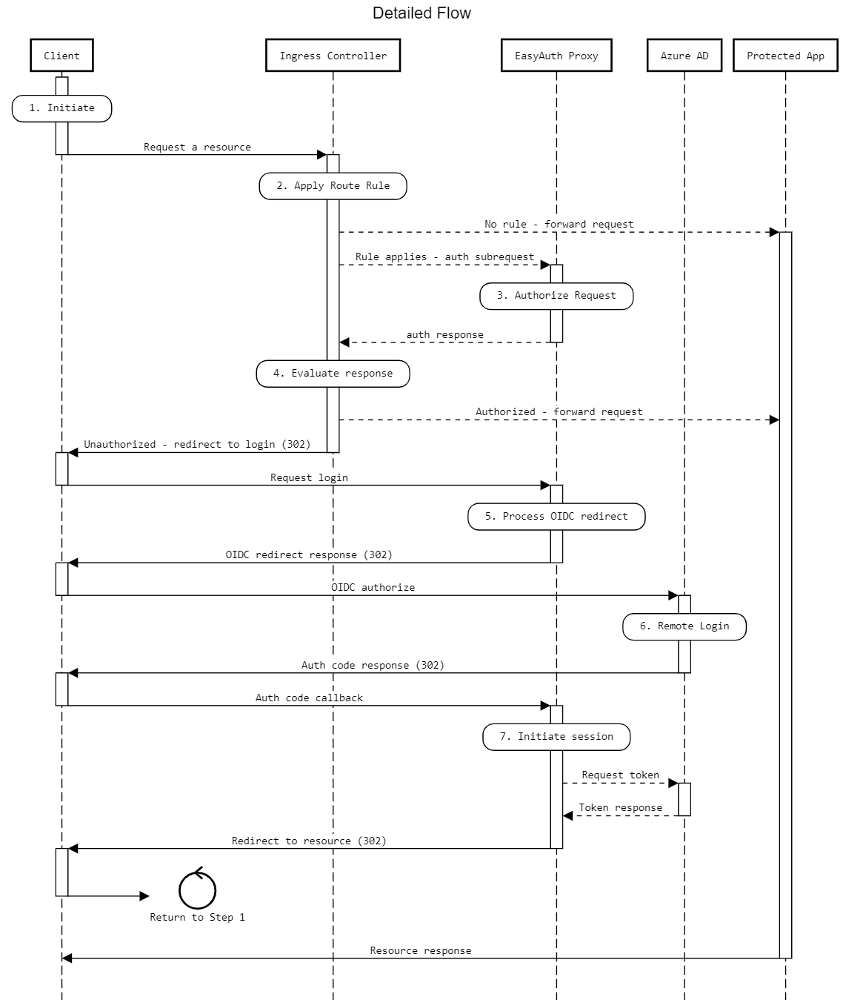

# Detailed Architecture
In order to work, EasyAuth requires a complex series of interactions between different services.  OAuth typically involves three parties or "legs":
1. The client
2. The identity provider
3. The protected resource or "relying party"

With EasyAuth, there are four parties involved (five, if you count the application you are protecting):
1. The client
2. The ingress controller
3. The EasyAuth proxy
4. The identity provider (Azure AD)
5. The protected resource

The basic responsibilities of each are no different in either case, but some are shared between 2 or more of the above services.

Here are the basics:
| Party  | Notes  |
| - | - |
| Client |  The application that is interacting with the server on behalf of a user or process -- most likely a web browser.|
| Ingress Controller |  In this case NGINX.  Handles routing and load balancing of inbound requests and provides hooks for "external" authentication, which you can read more about [here](https://kubernetes.github.io/ingress-nginx/examples/auth/oauth-external-auth/)|
| EasyAuth proxy |  A pod running within your kubernetes cluster that acts as an authorization server for the ingress controller, a relying party for the identity provider, and an identity provider for the client|
|Identity Provider| Azure AD.  Authenticates the user, manages consent, and provides tokens.  There are lots of other features it could possibly provide as well -- federation, conditional access and MFA to name a few.|
|Protected Resource| Any type of web-based application that can be deployed to kubernetes.  It has the option of consuming header information injected by the EasyAuth proxy, but otherwise have any responsibility or awareness of the other parties|

To help illustrate the interactions, below is what the flow actually looks like, followed by more details about each step.

*Note: The dashed arrows are interactions that the client can't see, so, for example, they wouldn't show up in a fiddler trace*

| Step  | Notes  |
| - | - |
| 1 |  The client requests a resource (page, image, file, etc) that is served by the protected app.|
| 2 |  NGINX applies any matching ingress.  If the ingress defines `nginx.ingress.kubernetes.io/auth-url`, a subrequest containing headers from the request (including cookies) is sent to the configured authUrl.  In this case should be the url for the `easyAuthForK8s.authPath` configuration value.  If there is no `auth-url` configured, the request is forwarded directly to the protected app without any authorization|
| 3 |  EasyAuth authenticates and authorizes the request based on the previously created cookie, or (if `allowBearerToken` is configured) a token found in the authorization header.  If no token is found or the token does not have privelages matching those configured for the ingress, a 401 "Access Denied" status is returned, along with a state cookie describing the reason for the failure and information that is used is step 5.  If authorization succeeds, a status 202 "Accepted" is returned to NGINX along with any headers you've configured the back-end to receive|
| 4 |  NGINX can do one of two things with the response based on the response code:  In the case of success, it *forwards* the request to the protected-app, with the informational headers added to the request.  If the auth request failed, the request is *redirected* to the url configured in `nginx.ingress.kubernetes.io/auth-signin`.|
| 5 |  EasyAuth reads the state cookie returned from Step 3.  If the authorization failure was terminal (eg, an invalid scope, or a role the user doesn't have was requested) an error message is rendered.  Otherwise, EasyAuth prepares an OIDC message based on its configuration and authorization parameters collected in Step 3, and redirects the user to Azure AD to login or request a highler privelaged token.  If a graph query is part of of the configuration, it is added to the OIDC message state so that it can be processed after a successful login|
| 6 |  The "external" login process takes place.  This might not require any input from the user if they are already logged in to Azure AD through another application -- in fact throughout this process, the user may never notice they were ever redirected at all.  If federation, or MFA, or other features of Azure AD are being used, it happens during this step.|
| 7 |  Azure AD returns the user to the `azureAd.callbackPath` url, where EasyAuth exchanges the authorization code for a token.  Information from the token, along with any graph query results (if configured) are encrypted and saved along with the auth ticket in a cookie that is returned to the client.  The cookie provides the information needed for Step 3 in all subsequent requests.EasyAuth redirects the request to the url from the original request in Step 1, causing the process to start over, but this time succeeding in Step 3.|