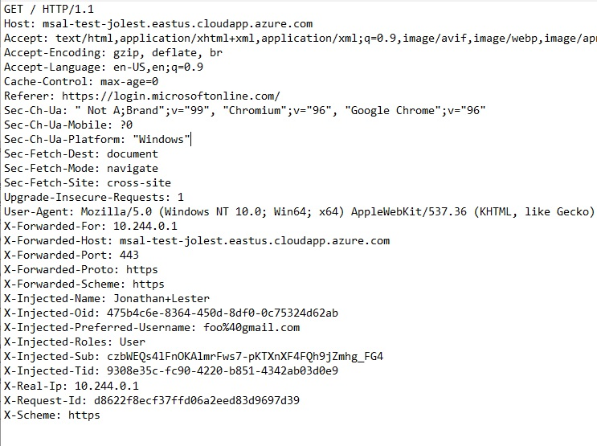

# Injected Headers
When a caller is authenticated, the EasyAuth service will inject claims about the user's identity as HTTP Headers when forwarding the request to the protected service.

>**Warning!!**\
Headers contain information that may be classified as PII data.  This data is transmitted in clear text within the cluster, and in most cases can be safely ignored if you don't wish to use it.  However, if you do make use of these headers please take precautions to protect this data and the privacy of your end users.

>**Warning!!**\
Injected headers are intended to provide information about the user, however they should not be used to make authorization decisions.  You should configure EasyAuth via ingress rules to make authorization decisions on behalf of your application instead.  For example, if the path "/foo/admin" requires the application role "Administrator", you should configure an ingress rule to require the Administrator role for that path. 

> *Note!* Claims in OAuth tokens sometimes contain characters that are not allowed in HTTP Headers.  By default, values will be Url-Encoded.  For other options, see [Configuration](docs/configuration.md)

## Common/Useful Headers
| Name  | Notes  |
| - | - |
| x-injected-name | A human-readable value that identifies the subject of the token. The value is not guaranteed to be unique, it is mutable, and it's designed to be used only for display purposes.|
| x-injected-oid | The immutable identifier for an object in the Microsoft identity system, in this case, a user account. This ID uniquely identifies the user across applications - two different applications signing in the same user will receive the same value in the oid claim.|
| x-injected-preferred-username | The primary username that represents the user. It could be an email address, phone number, or a generic username without a specified format. Its value is mutable and might change over time.|
| x-injected-sub | The OAuth subject claim or principal about which the token asserts information, such as the user of an app. This value is immutable and is specific to an Azure AD application.|
| x-injected-roles | The set of permissions exposed by your application registration that the user has been assigned to. This header may contain multiple values as a pipe-delimited string (e.g. "Foo1|Foo2"), a single value ("Foo"), or not be present depending on your application's configuration.  See: [Add app roles to your application](https://docs.microsoft.com/en-us/azure/active-directory/develop/howto-add-app-roles-in-azure-ad-apps)|
| x-injected-email | The addressable email for this user, if the user has one and they have granted consent for it to be shared with the application.|
| x-injected-groups | A list of group memberships, depending on how you have [configured them](https://docs.microsoft.com/en-us/azure/active-directory/develop/active-directory-optional-claims#configuring-groups-optional-claims) for the application.|
| x-injected-graph | Pipe-delimited responses from MS Graph API calls, if you have configured any.  Responses will be in the same order as the original query fragments.  Note that graph queries results are not provided with Bearer token authentication for performance reasons.  Queries are run once during login, and results are stored within the encrypted ticket in an auth cookie.  Results do not update until the user logs in again.|
| x-injected-userinfo | A single header containing all claims as a JSON object, if you have chosen to use the "Combined" header format.  See decoded sample below.|

## Sample UserInfo Header
    {
        "name": "Jon Lester",
        "oid": "00000000-0000-0000-66f3-3332eca7ea81",
        "preferred_username": "jlester",
        "roles": [
            "Admin",
            "User"
        ],
        "sub": "AAAAAAAAAAAAAAAAAAAAAIkzqFVrSaSaFHy782bbtaQ",
        "tid": "9122040d-6c67-4c5b-b112-36a304b66dad",
        "email": "user@contoso.com",
        "groups": "",
        "scp": "openid email Foo User.Read",
        "otherClaims": [
            {
            "fooclaim": "fooValue"
            }
        ],
        "graph": [
            {
            "displayName": "Jon Lester"
            },
            {
            "value": "some value"
            }
        ]
    }