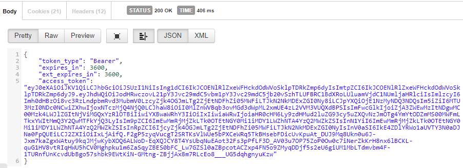

# Protecting and calling an API
When you configure EasyAuth to protect an API, it is assumed that the caller cannot support a browser redirect to Azure AD.  For this reason, the flow works a bit differently for applications such as:
* A single-page web application or mobile application that authenticates users with it's own sign in form
* A service-to-service API call where the caller is not an interactive process

In these cases, you can still protect your API application with EasyAuth, but the caller will need to acquire a token on its own and add the token to the Authorization header on each request.  If a valid header is not present, EasyAuth will return a 401 (Unauthorized) response, with a message describing how the caller can acquire a valid OAuth bearer token.

## Registering a client application
As a prerequisite, you must register your client application with Azure AD before you can acquire tokens to access a protected API.  The application must be registered in the same Azure AD tenant that the EasyAuth service uses if EasyAuth is configured for single tenant authentication.

To register the client application, follow [these instructions](https://docs.microsoft.com/en-us/azure/active-directory/develop/quickstart-register-app).  Make note of the Application Id, since this will be used as the `client_id` in OAuth flows.

For a native or SPA applications that will be signing in an end user, no additional configuration is necessary.  However, for service or daemon clients, you'll need to complete a few more steps to allow your client to call an API with it's own identity.
* Configure a [client credential](https://docs.microsoft.com/en-us/azure/active-directory/develop/quickstart-configure-app-access-web-apis#add-credentials-to-your-web-application) to allow the client to use the OAuth [client credentials flow](https://docs.microsoft.com/en-us/azure/active-directory/develop/v2-oauth2-client-creds-grant-flow).
* [Grant your client permission](https://docs.microsoft.com/en-us/azure/active-directory/develop/quickstart-configure-app-access-web-apis#add-permissions-to-access-web-apis) to access to the protected API.  The name of the API will be the name of your EasyAuth service.

Once these steps are complete, you will be able to acquire a token to access the protected API.

## Using Client Credentials
For clients with no user, you'll use the OAuth2 [client credentials](https://docs.microsoft.com/en-us/azure/active-directory/develop/v2-oauth2-client-creds-grant-flow#get-a-token) grant to acquire a token.   

Note that you will also need the client_id and secret from the application you registered above.  Here's a sample response:

Take the `access_token` value, and add an `Authorization` header in the form of `Bearer <access_token_value>` to send an properly authenticated request to your protected api.

